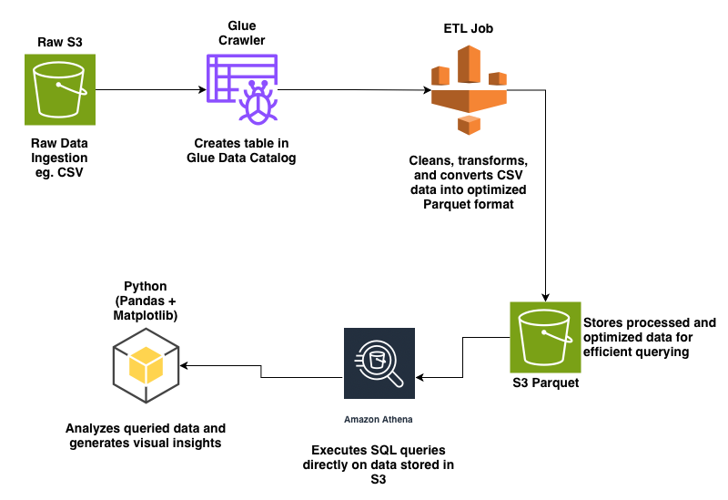
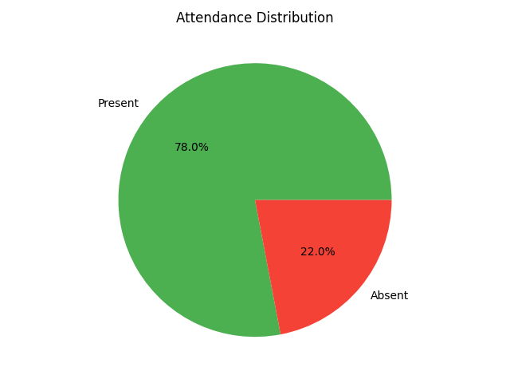
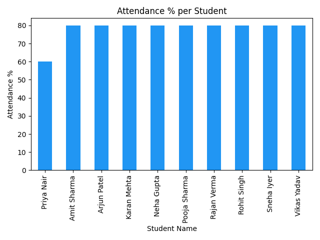
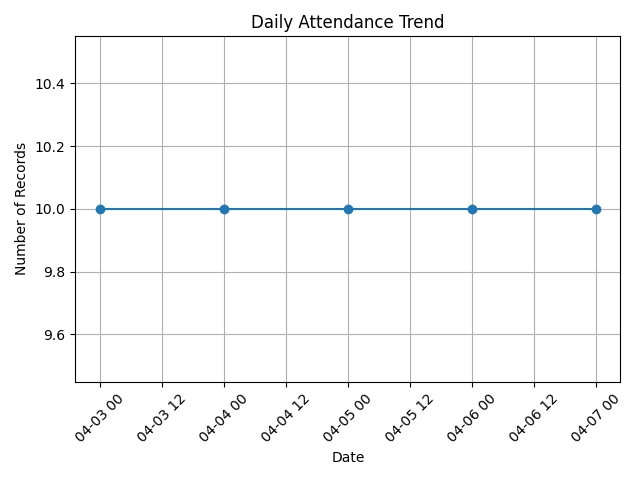

# 📊 End-to-End Attendance Data Pipeline on AWS

## Overview
This project demonstrates a complete **data engineering pipeline** built on AWS, starting from raw CSV data ingestion to analytics and visualization.

It simulates a real-world student attendance system where data is:
- Collected
- Processed
- Stored efficiently
- Queried
- Visualized for insights

---

## Architecture

---

## Tech Stack

- **AWS S3** – Raw & processed data storage  
- **AWS Glue (Crawler + ETL Job)** – Data cataloging & transformation  
- **AWS Athena** – SQL-based querying  
- **Python (Pandas, Matplotlib)** – Data analysis & visualization  
- **Git & GitHub** – Version control  

---

## Pipeline Flow

1. **Data Ingestion**
   - Raw attendance CSV uploaded to S3

2. **Data Processing**
   - Glue Crawler detects schema and creates tables
   - Glue ETL Job cleans and transforms data

3. **Data Storage**
   - Clean data stored in S3 in **Parquet format**

4. **Data Querying**
   - Athena used to run SQL queries on processed data

5. **Data Visualization**
   - Python (Pandas + Matplotlib) used to generate insights

---

## Project Structure
attendance-data-pipeline-aws/
│
├── images/
│ ├── architecture.png
│ ├── attendance_distribution.png
│ ├── attendance_percentage.png
│ └── attendance_trend.png
│
├── visual.py
├── attendance.parquet
└── README.md

---

## Sample Visualizations

### 📌 Attendance Distribution

### 📌 Attendance Percentage

### 📌 Attendance Trend Over Time

---

## Key Features

- End-to-end pipeline using AWS services  
- Efficient storage using Parquet format  
- Serverless querying with Athena  
- Real-world simulation of attendance tracking system  
- Data visualization using Python  

---

## Challenges Faced

- Handling IAM permissions across AWS services  
- Fixing Glue ETL job overwrite issues  
- Managing QuickSight access (eventually replaced with local visualization)  
- Setting up proper data flow between S3 → Glue → Athena  

---

## Future Improvements

- Add real-time ingestion using Kinesis  
- Automate pipeline using AWS Step Functions  
- Deploy dashboard using Streamlit or Power BI  
- Add alert system for low attendance  

---

## Learnings

- Practical understanding of AWS data services  
- Importance of data formats like Parquet  
- ETL pipeline design and debugging  
- Handling real-world cloud permission issues  

---

## Author

**Rajan Verma**  
Engineering Student | Aspiring Data Engineer  

---

## If you like this project

Give it a star and connect with me on LinkedIn!
